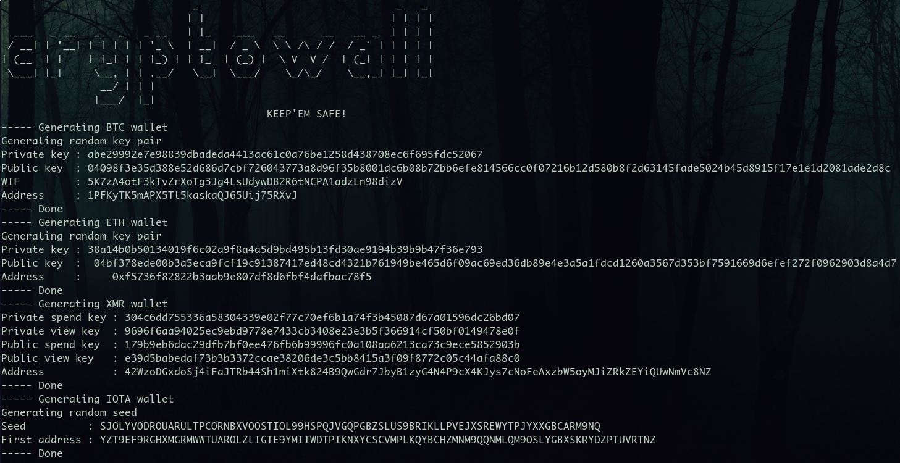

_Cryptowall_ is an offline Docker container which generates random crypto wallets. It prints out the most useful informations: _private key_, _public key_ and _address_. With those informations, you will be able to receive funds and recover your wallet any time.

It currently supports Bitcoin, Ethereum, Monero and Iota tokens.



## Motivation

I want a tool to easily generate random wallets on the fly for various cryptocurrencies.

Scripts need to be easily understood.
- Scripts are written as short as possible.
- Methods used are described below & sources are given.
- Commented scripts can be found in the folder named after the token.

Wallets need to be generated offline to prevent any leak.
- A Docker container run with `--network=none` is the way to go.

## Usage

Cryptowall currently supports Bitcoin, Ethereum and Iota tokens. Create an issue if you want a specific token to be implemented.

```sh
$ docker run --network=none lapwat/cryptowall btc eth xmr iota
```
## Methods used

### Bitcoin / Ethereum

I used the method and script described in [this excellent article](https://kobl.one/blog/create-full-ethereum-keypair-and-address) from Vincent Kobel. He explaines how to generate an ECDSA keypair with OpenSSL and how to derive the public key into the corresponding address.

I used [this method](https://en.bitcoin.it/wiki/Wallet_import_format) to convert the private key into Wallet Import Format. I used [this technique](https://en.bitcoin.it/wiki/Technical_background_of_version_1_Bitcoin_addresses) to convert the public key into the corresponding Bitcoin address.

### Monero

I followed the official _Mnemonic (Electrum or Deterministic) Style_ explained at the bottom of [this page](https://xmr.llcoins.net/addresstests.html).

### Iota

I used the class _AddressGenerator_ from the official python library [pyota](https://github.com/iotaledger/iota.lib.py).
